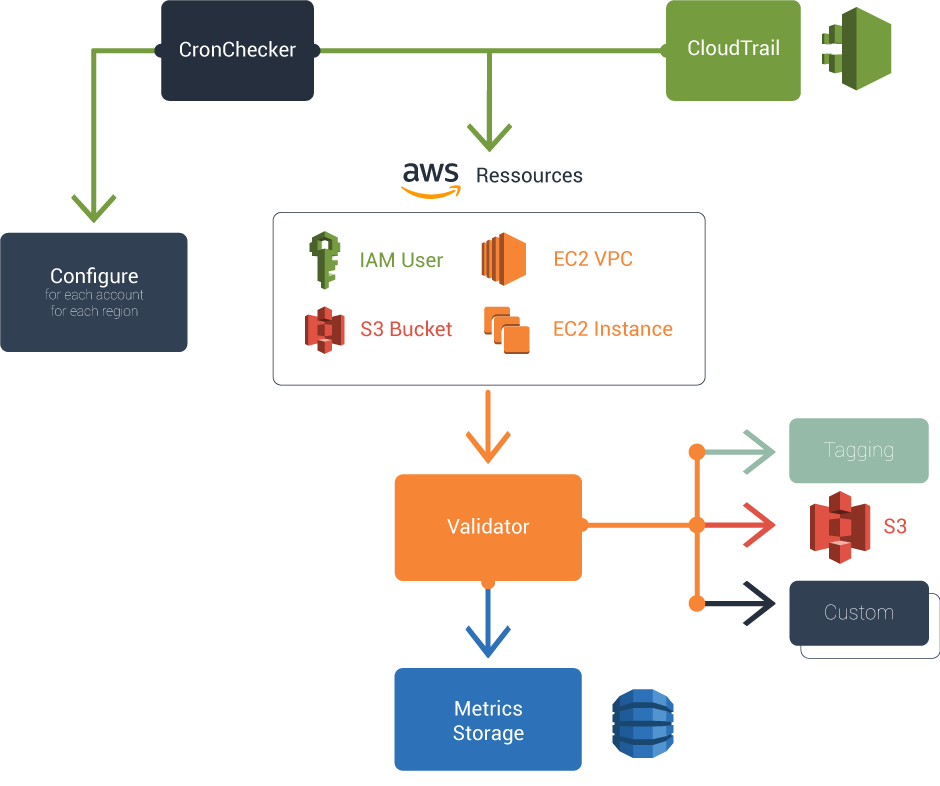
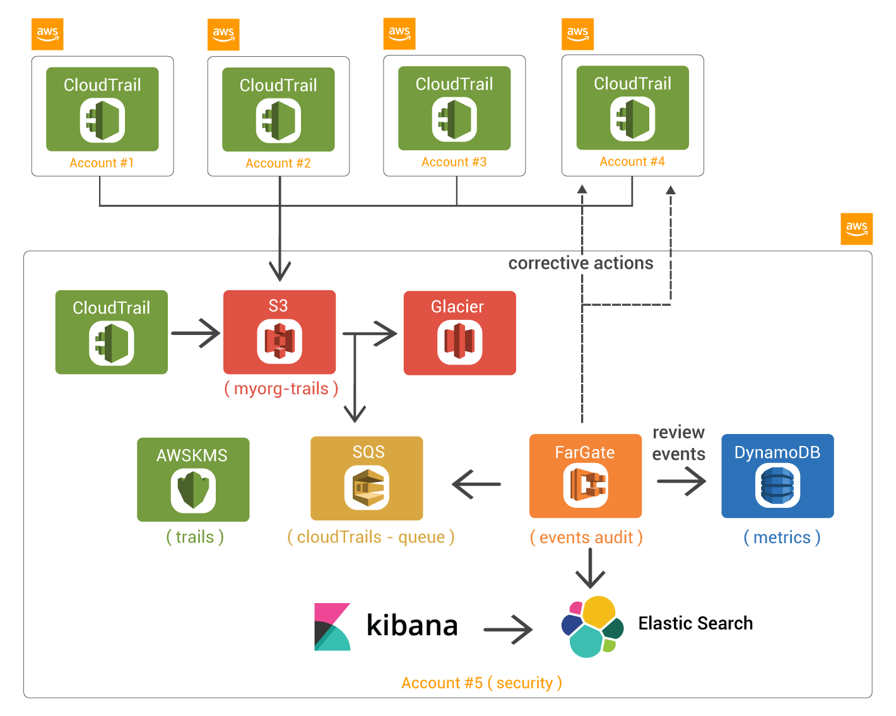

# IvoryShield

<p align="center">
  
</p>

This project aims to solve monitoring and auto-remediation of your AWS accounts, with a reasonable budget

It have two components :
 - A CronScanner to get metrics periodically
 - A CloudTrail parser to remediate in real time

Both CloudTrail and CronScanner map AWS Resources to an object, and then use defined Validators.

It will configure your AWS accounts, and launch on Fargate both components

Should you have any question, feel free to contact us: contact@ivoryshield.io

## Quick start

Create your ivoryshield project

```
# Install webda-shell
yarn add --global webda-shell

# Create your project
mkdir ivoryshield-config
cd ivoryshield-config
yarn init
yarn add ivoryshield

# Launch your config
webda config
```

## Software architecture :



## Typical deployment :



## Configurer

A configurer allow you to launch the take action on every account and every region

```
class Configurer {
   isEnableOn(account, region) {
   	   // Use this method to filter by region or account
      return true;
   }
}

```

A Validator is a simple Service :

```
const Validator = require('./validator');

module.exports = class IAMValidator extends Validator {

   isEnableOn(account, region) {
   	   // Use this method to filter by region or account
      return true;
   }

  validate(aws, resource) {
  	 let metrics = {};
  	 // Add your own logic here

  	 return Promise.resolve(metrics);
  }
}
```

A TaggingValidator example will look like :

```
const Validator = require('./validator');

module.exports = class TaggingValidator extends Validator {
  validate(aws, resource) {
    let metrics = {};
    let promise = Promise.resolve();
    let error = '';
    if (!resource.canTag()) {
      return Promise.resolve(metrics);
    }
    // Make billing-category and billing-subcategory mandatory
    if (!resource.getTag('billing-category') || !resource.getTag('billing-subcategory')) {
      metrics['InvalidTags'] = 1;
      error = 'Required tags are billing-category billing-subcategory';
    }
    // Forbid usage of customer for billing-subcategory
    if (resource.getTag('billing-subcategory') === 'customer' && !metrics['InvalidTags']) {
      metrics['InvalidTags'] = 1;
      error = 'Tag billing-subcategory cannot be customer';
    }
    // Ensure billing-category is one of 5
    if (['customers','internal','presales','build', 'infra'].indexOf(resource.getTag('billing-category')) < 0 && !metrics['InvalidTags']) {
      metrics['InvalidTags'] = 1;
      error = 'Tag billing-category must be one of customers internal presales build';
    }
    // Get metrics for badly tag EC2Instance
    if (resource.constructor.name === 'EC2Instance' && metrics['InvalidTags']) {
      metrics['EC2InstanceInvalidTags'] = 1;
    }
    // Get metrics for badly tag S3Bucekt
    if (resource.constructor.name === 'S3Bucket' && metrics['InvalidTags']) {
      metrics['S3BucketInvalidTags'] = 1;
    }
    // Tag resource with policy:tags-policy-error resource badly tagged
    if (metrics['InvalidTags'] && resource.getTag('policy:tags-policy-error') !== error) {
      promise = promise.then( () => {
        return resource.tag({'policy:tags-policy-error': error});
      });
    }
    // Remove Tag from resource newly compliant
    if (!metrics['InvalidTags'] && resource.getTag('policy:tags-policy-error')) {
      promise = promise.then( () => {
        return resource.untag({'policy:tags-policy-error': resource.getTag('policy:tags-policy-error')});
      });
    }
    return promise.then( () => {
      return Promise.resolve(metrics);
    });
  }
}
```

Resources available for now :

```
AMI
EC2Instance
EIP
IAMUser
InternetGateway
NatGateway
NetworkInterface
S3Bucket
SecurityGroup
Snapshot
Subnet
Volume
VPC
```

Resource also defined which CloudTrail event require reevaluations of this resource :

```
const Resource = require('./Resource');

module.exports = class S3Bucket extends Resource {

  static getEventMapper() {
    return {
      'PutBucket.*': 'requestParameters.bucketName',
      'CreateBucket': 'requestParameters.bucketName'
    }
  }
  ...
}
```

The event mapper key is a RegExp to determine which type of event should generate Resource evaluation, the event mapper value represent the JSON Path to the resource id on the target event.
